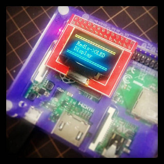

redis-oled-display.c
====

Display driver program for Raspberry Pi 0.96inch LED Display Module

- http://www.seeedstudio.com/depot/Raspberry-Pi-096-OLED-Display-Module-p-2390.html
- http://akizukidenshi.com/catalog/g/gP-09346/

Setup
----

    $ sudo apt-get install redis-server
    $ sudo apt-get install git-core
    $ mkdir -p ~/work
     
    $ cd ~/work
    $ git clone git://git.drogon.net/wiringPi
    $ cd wiringPi
    $ ./build
     
    $ cd ~/work
    $ git clone https://github.com/redis/hiredis.git
    $ cd hiredis
    $ make
    $ sudo make install
     
    $ sudo ldconfig

Compile & Run
----

    $ cd ~/work
    $ git clone https://github.com/yoggy/redis-oled-display.git
    $ cd redis-oled-display
      
    $ make
    $ sudo ./redis-oled-display

How to use
----

    $ redis-cli
    $ redis 127.0.0.1:6379> set oled:0 title
    OK
    $ redis 127.0.0.1:6379> set oled:1 "test string"
    OK
    $ redis 127.0.0.1:6379> set oled:2 "test test test"
    OK
    $ redis 127.0.0.1:6379> set oled:3 "0123456789012345"
    OK

Copyright and license
----

Copyright (c) 2015 yoggy

Released under the [MIT license](LICENSE.txt)

